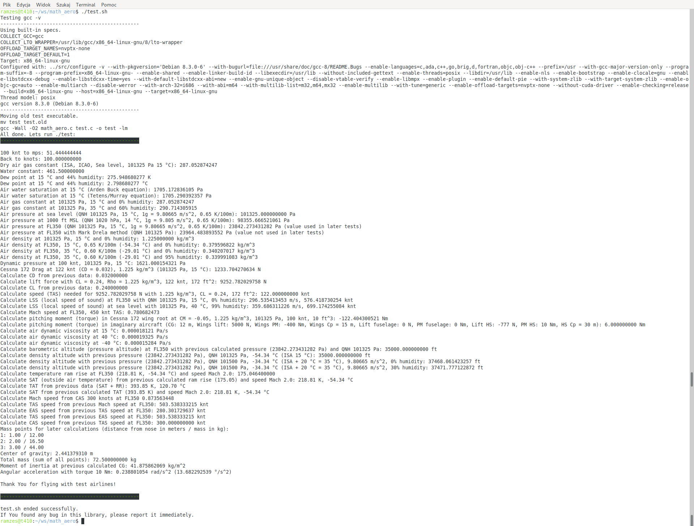

## What is this?

This is a library for aerodynamic, metrology and physics calculations. Same calculations as used in ADC and other aircraft computers. This also can be used in flight simulations.

Whole library was made with idea to make calculations incredibly precise (calculation error 0.1% at worst case - especially calc_dew_point() function) and fast as possible (for less CPU time usage).

Most of used equations/methods are well known. Some are made by me to achieve better accuracy (less error) - especially with calculation of denisty altitude (true altitude).

## Important things

- Altitude calculations are limited to troposphere (up to 11 000 m MSL or 36 089 feet MSL) for less CPU time usage. Those functions will give error above troposphere, which will be increased with every feet.

- This library can be used in aircrafts (including UAVs), but WITHOUT ANY WARRANTY. You are responsible to made software tests and ground tests, before first flight. Additional tests (confirmations) in-flight are also recommended.

## Bugs reporting and questions

If You found any bug, or You just think something here can be done better, then please inform me immediately by sending email to adress which is in source code.

Bug report(s) can possibly prevent somebody crash, which hopefully will never happen.

Questions are welcome too.

## Used operating system, CPU and C compiler at programming and testing

Debian GNU/Linux 10.11 (Stable).

cat /proc/cpuinfo 
processor	: 0
vendor_id	: GenuineIntel
cpu family	: 6
model		: 30
model name	: Intel(R) Core(TM) i7 CPU       Q 720  @ 1.60GHz
stepping	: 5
microcode	: 0x5
cpu MHz		: 933.386
cache size	: 6144 KB
physical id	: 0
siblings	: 8
core id		: 0
cpu cores	: 4
apicid		: 0
initial apicid	: 0
fpu		: yes
fpu_exception	: yes
cpuid level	: 11
wp		: yes
flags		: fpu vme de pse tsc msr pae mce cx8 apic sep mtrr pge mca cmov pat pse36 clflush dts acpi mmx fxsr sse sse2 ss ht tm pbe syscall nx rdtscp lm constant_tsc arch_perfmon pebs bts rep_good nopl xtopology nonstop_tsc cpuid aperfmperf pni dtes64 monitor ds_cpl vmx smx est tm2 ssse3 cx16 xtpr pdcm sse4_1 sse4_2 popcnt lahf_lm pti tpr_shadow vnmi flexpriority ept vpid dtherm ida
bugs		: cpu_meltdown spectre_v1 spectre_v2 spec_store_bypass l1tf mds swapgs itlb_multihit
bogomips	: 3192.05
clflush size	: 64
cache_alignment	: 64
address sizes	: 36 bits physical, 48 bits virtual
power management:

gcc -v

Using built-in specs.
COLLECT_GCC=gcc
COLLECT_LTO_WRAPPER=/usr/lib/gcc/x86_64-linux-gnu/8/lto-wrapper
OFFLOAD_TARGET_NAMES=nvptx-none
OFFLOAD_TARGET_DEFAULT=1
Target: x86_64-linux-gnu
Configured with: ../src/configure -v --with-pkgversion='Debian 8.3.0-6' --with-bugurl=file:///usr/share/doc/gcc-8/README.Bugs --enable-languages=c,ada,c++,go,brig,d,fortran,objc,obj-c++ --prefix=/usr --with-gcc-major-version-only --program-suffix=-8 --program-prefix=x86_64-linux-gnu- --enable-shared --enable-linker-build-id --libexecdir=/usr/lib --without-included-gettext --enable-threads=posix --libdir=/usr/lib --enable-nls --enable-bootstrap --enable-clocale=gnu --enable-libstdcxx-debug --enable-libstdcxx-time=yes --with-default-libstdcxx-abi=new --enable-gnu-unique-object --disable-vtable-verify --enable-libmpx --enable-plugin --enable-default-pie --with-system-zlib --with-target-system-zlib --enable-objc-gc=auto --enable-multiarch --disable-werror --with-arch-32=i686 --with-abi=m64 --with-multilib-list=m32,m64,mx32 --enable-multilib --with-tune=generic --enable-offload-targets=nvptx-none --without-cuda-driver --enable-checking=release --build=x86_64-linux-gnu --host=x86_64-linux-gnu --target=x86_64-linux-gnu
Thread model: posix
gcc version 8.3.0 (Debian 8.3.0-6)

## Test.sh

This script will compile test.c, which will perform some tests. Those tests will use ALL of this library functions. This can be used to cross-check calculations.

Print-screen of test.sh output from my machine:

## License

[GPL V2](https://www.gnu.org/licenses/old-licenses/gpl-2.0.html) - included with repository in text format.
